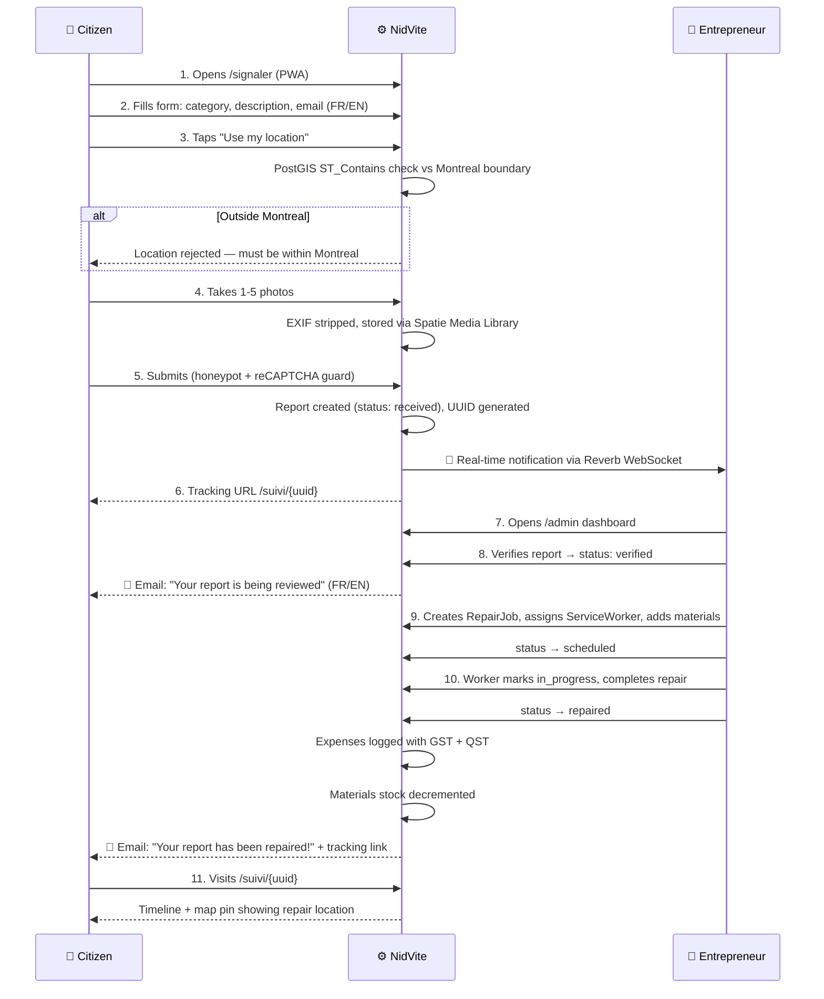

# NidVite

Frictionless pothole reporting bridge for Montreal citizens and repair entrepreneurs.

## About

NidVite is a bilingual (FR/EN) web application that lets Montreal citizens report infrastructure issues (potholes, graffiti, broken lights, sidewalk damage) without creating an account, and gives repair entrepreneurs a Filament dashboard to manage, track, and repair those reports.

## Tech Stack

- **Backend:** Laravel 11, PHP 8.2+
- **Database:** PostgreSQL 15 + PostGIS 3.4 (spatial queries, geofencing)
- **Admin:** Filament v5 (RBAC, 5 roles, 2FA)
- **Frontend:** Livewire 3, Alpine.js, Tailwind CSS
- **Real-time:** Laravel Reverb (WebSocket notifications)
- **Auth:** Laravel Fortify (2FA TOTP + passkeys)
- **Mail:** Resend (transactional emails)
- **PWA:** Service worker + manifest via laravelpwa
- **Testing:** Pest 2, PHPStan Level 5, Laravel Pint
- **Deployment:** Railway

## Key Features

- **Zero-auth reporting** — Citizens submit reports with just an email
- **Geofencing** — Only Montreal locations accepted (PostGIS boundary check)
- **Photo uploads** — Up to 5 photos per report with EXIF stripping
- **State machine** — Reports: Received → Verified → Scheduled → In Progress → Repaired / Rejected
- **Real-time dashboard** — New report notifications via WebSocket
- **Bilingual** — French-first with English toggle
- **PWA** — Installable on mobile with offline support
- **Public map** — Leaflet map showing all reports with color-coded markers
- **Job & expense tracking** — Repair jobs, vendors, materials, expenses with Quebec tax (GST+QST)

## The Happy Path

Every status transition (received→verified→scheduled→in_progress→repaired) sends a localized email to the citizen and fires a real-time notification to the dashboard. Any transition can also go to `rejected` with a mandatory reason — the citizen gets an email explaining why.

---

## Architecture Decisions

### Security

- **Fortify + 2FA**: Admin dashboard requires TOTP two-factor auth with QR code setup and recovery codes. No admin can log in without 2FA enabled. Passkey/WebAuthn support is also wired up.
- **RBAC with 5 roles**: Admin, Manager, Service Worker, Accountant, Viewer — each with distinct Filament resource permissions enforced via Policies. Viewer can only read; Accountant can only touch expenses; Service Workers can create/edit repair jobs but not delete; only Admin can delete or manage users.
- **Fortify action classes**: All auth flows (registration, password reset, profile update) go through hardened action classes, not default scaffolding.
- **Session isolation**: Admin sessions are separate from any citizen-facing session. The citizen side has zero auth — no session spillage possible.

### Bot & Spam Protection (Layered)

- **Layer 1 — Honeypot**: `spatie/laravel-honeypot` injects invisible fields. Bots that fill them get silently rejected. Zero UX friction for humans.
- **Layer 2 — reCAPTCHA v2 Invisible**: Google reCAPTCHA runs in the background. Only triggers a challenge if the user seems suspicious. Installed and wired; enforcement pending.
- **Layer 3 — PostGIS Geofencing**: `MontrealBoundary::contains()` runs `ST_Contains` against the official City of Montreal boundary polygon. Reports outside Montreal are rejected at the server level — no amount of spoofing bypasses this because the server re-validates coordinates.
- **Layer 4 — EXIF Stripping**: All uploaded photos have EXIF metadata removed server-side via `ExifStripper` (Intervention Image). Prevents accidental location/personal data leaks from citizen photos. Also neutralizes any steganographic payloads.

### Data Integrity

- **State Machine**: `ReportStatus` enum enforces strict transition rules. Invalid transitions (e.g., jumping from `received` directly to `repaired`) throw `InvalidArgumentException`. The state machine is tested with 17 dedicated tests covering every valid and invalid path.
- **UUID public identifiers**: Reports use UUIDs for public URLs (`/suivi/{uuid}`), never sequential IDs. Prevents enumeration attacks — you can't guess another report's tracking URL.
- **Spatie ActivityLog**: Every Report status change, priority change, admin note, and rejection reason is logged with the user who made the change and the timestamp. Full audit trail, no silent mutations.
- **Soft Deletes**: Reports use `SoftDeletes` — deletions are reversible. Only Admin can force-delete.
- **Queued emails**: `ReportStatusUpdated` implements `ShouldQueue` on the database driver. If email delivery fails, the job retries without blocking the status transition. No data loss.

### Regional Law Compliance (Quebec / Canada)

- **Quebec Law 25 (Bill 64)**: Quebec's privacy law requires consent for collecting personal data, data minimization, and the right to access/delete. NidVite's design:
  - Citizens provide only an email — no name, no phone, no account. Minimal PII by design.
  - `preferred_locale` is set per-report, not tied to a user profile. No cross-report profiling.
  - EXIF is stripped from photos before storage — no geolocation metadata retained in images.
  - Data retention policy designed: reports auto-expire after 2 years, IP hashes purged after 30 days, device fingerprints after 90 days.
- **French-first (Charter of the French Language)**: Quebec's Bill 96 requires French as the default language for software used in Quebec. NidVite defaults to French (`app.locale = 'fr'`, `fallback_locale = 'fr'`). All citizen-facing strings, emails, and PWA content are French by default with an English toggle available.
- **GST + QST tax handling**: Quebec has a dual tax system (5% GST + 9.975% QST). Expenses track both taxes separately and compute `total = amount + gst + qst` at the model level, ensuring accurate reporting for Revenu Québec.
- **Montreal Open Data (CC-BY)**: The city boundary polygon used for geofencing is sourced from Montreal's official open data portal under a Creative Commons Attribution license, complying with municipal data usage terms.

---

## Documentation

- [Setup Guide](docs/SETUP_GUIDE.md)
- [Tech Stack](docs/engineering/TECH_STACK.md)
- [Project Structure](docs/engineering/PROJECT_STRUCTURE.md)
- [Database Schema](docs/database/SCHEMA_OVERVIEW.md)
- [Coding Manifesto](docs/engineering/CODING_MANIFESTO.md)
- [Integration Specs](docs/integrations/INTEGRATION_SPECS.md)
- [Security & Privacy](docs/security/SECURITY_PRIVACY.md)
- [Monitoring](docs/engineering/MONITORING_PACKAGES.md)
- [Railway Runtime (Phase 5)](docs/process/RAILWAY_PHASE5_RUNTIME.md)
- [Roadmap](.planning/ROADMAP.md)

## License

Proprietary. All rights reserved.
